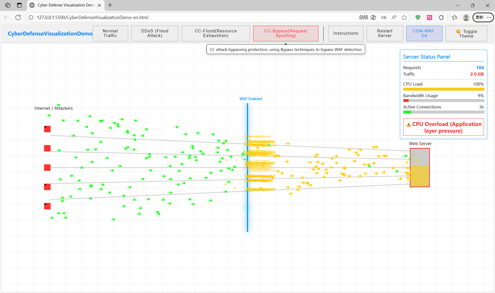
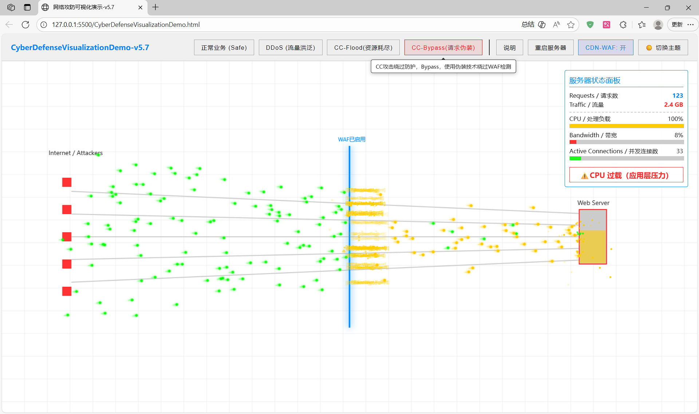

# English:
# CyberDefenseVisualizationDemo

Explanation: This project is a spontaneous work, so it may not be considered complete, similar to a simple practice project

A visual interactive demonstration project for network attack and defense education, drawn using Canvas. It simulates various network attack scenarios and defense mechanisms, providing an intuitive way for users to learn about network security concepts through dynamic visualization and interactive operations.

**[Online Demo (Click to Visit - Chinese Site)](https://www.rockaz.top/CyberDefenseVisualizationDemo/)**  
*Note: This website's server is located in China, ensuring faster and more stable access for users within China. The page language is Chinese. For security defense purposes (to protect against a large number of automated attack IPs from outside China), we have blocked all traffic originating from outside China.*

**[Online Demo (Click to Visit - English Site)](https://add-qwq.github.io/CyberDefenseVisualizationDemo(DemoPage)/CyberDefenseVisualizationDemo-en.html)**  
*Note: This website is hosted on GitHub Pages. Users within China may experience significant latency when accessing it, and it is suitable for users outside China (users worldwide).*

## Core Features
1. **Multiple Attack Scenarios Simulation**:
   - Normal traffic simulation
   - DDoS attack simulation (high-volume, high-speed malicious traffic)
   - CC attack simulation (targeted application-layer pressure)
   - Bypass attack simulation (simulating fake User-Agent/IP spoofing behaviors)
2. **Defense Mechanism Demonstration**:
   - WAF (Web Application Firewall) switch function, showing real-time blocking of malicious traffic
3. **System Status Monitoring**:
   - Real-time display of server CPU load, bandwidth usage, connection count, and health status
   - Statistics of total requests and data volume processed by the server
   - Alert prompts for abnormal status (CPU overload, bandwidth saturation, server crash)
4. **Interactive Functions**:
   - Light/dark theme switching (supports system theme adaptation)
   - Education panel (contains network security knowledge and explanations)
   - One-click server restart and attack mode switching
5. **Visual Effects**:
   - Dynamic packet transmission animation with differentiated colors for different traffic types
   - Explosion effects for blocked/effective attacks
   - Real-time updates of server load status bar and network lines
   - Annotation prompts for attack behaviors (e.g., Fake User-Agent, IP Spoofing)

## Demo Screenshot

## File Description
- English version files:
  - `CyberDefenseVisualizationDemo-all-en.html`: Integrated file containing JS, CSS, and HTML. No additional configuration required—just open it in a browser to use.
  - `CyberDefenseVisualizationDemo-en.html`: Separate HTML file
  - `CyberDefenseVisualizationDemo-en.js`: Core logic script (simulation, interaction, rendering)
  - `CyberDefenseVisualizationDemo-en.css`: Style file (supports light/dark themes)

## How to Use
1. Go to the [Releases](https://github.com/add-qwq/CyberDefenseVisualizationDemo/releases) page to download the ZIP package
2. Extract the downloaded file to any directory
3. Open the corresponding version file in a modern browser (Chrome, Firefox, Edge recommended):
   - For one-click use: Open `CyberDefenseVisualizationDemo-all-en.html` (English) or `CyberDefenseVisualizationDemo-all.html` (Chinese)
   - For separate file use: Ensure the HTML, JS, and CSS files of the same language are in the same directory, then open the HTML file
4. Interactive Operation Guide:
   - Attack Mode Switch: Click "Normal", "DDoS", "CC", "Bypass" buttons to switch between different traffic/attack modes
   - WAF Control: Click "CDN-WAF: 关/开" to enable/disable the firewall
   - Theme Switch: Click "🌙 切换主题" / "☀️ 切换主题" to switch between dark/light modes
   - Education Panel: Click "Security Knowledge" to open/close the network security knowledge panel
   - Restart Server: Click "Restart Server" to reset server status and statistics

## Technical Highlights（?）
- Built with native JavaScript + Canvas, no third-party libraries required
- Responsive design, adapts to different screen sizes
- Smooth animation effects (packet transmission, explosions, status updates)
- Realistic simulation logic (traffic generation, server load calculation, WAF blocking rules)
- Persistent theme settings (supports local storage of user's theme preferences)
- Mobile device detection and usage prompts

## Runtime Environment
- Modern desktop browsers (Chrome 80+, Firefox 75+, Edge 80+, Safari 14+)
- For best experience, enable "Desktop Site" mode when using on mobile devices
- Screen resolution ≥ 1280×720 is recommended

## Notes
1. This project is for educational purposes only, not for actual network attack or defense deployment
2. The simulation logic is simplified for demonstration; it does not represent real network attack/defense principles in full detail
3. Mobile devices or small screens (width < 768px) may have limited interaction experience; please use desktop browsers for optimal results
4. If the page fails to load normally, check whether the file path is correct (separate files must be in the same directory)

---

# 中文：

# 网络攻防可视化演示项目

说明：此项目为一时兴起的作品，所以可能并不算完善，也就是类似一个简单的练习项目

一个用于网络攻防教育的可视化交互演示项目，使用Canvas绘制。该项目模拟了多种网络攻击场景及防御机制，通过动态可视化与交互式操作，帮助用户直观学习网络安全相关概念

**[在线演示（点击访问--中文站）](https://www.rockaz.top/CyberDefenseVisualizationDemo/)**  
*注：该网站服务器位于中国，中国境内用户访问更快速稳定页面语言为中文，但出于安全防御目的（为了防御大量来自中国境外的自动化攻击IP），我们已封锁所有中国以外的流量*

**[在线演示（点击访问--英文站）](https://add-qwq.github.io/CyberDefenseVisualizationDemo(DemoPage)/CyberDefenseVisualizationDemo-en.html)**  
*注：该网站由GitHub Page托管，中国境内用户访问可能有较大延迟，适合中国境外用户（全球各地用户）访问*

## 核心功能
1. **多种攻击场景模拟**：
   - 正常流量模拟
   - DDoS攻击模拟（大流量、高速恶意请求）
   - CC攻击模拟（针对应用层的定向压力测试）
   - 绕过攻击模拟（模拟伪造User-Agent、IP欺骗等行为）
2. **防御机制演示**：
   - WAF（Web应用防火墙）开关功能，实时展示恶意流量拦截效果
3. **系统状态监控**：
   - 实时显示服务器CPU负载、带宽占用、连接数、健康状态
   - 统计服务器处理的总请求数与数据量
   - 异常状态告警提示（CPU过载、带宽饱和、服务器崩溃）
4. **交互功能**：
   - 明暗主题切换（支持系统主题自适应）
   - 教育面板（包含网络安全知识讲解）
   - 服务器一键重启与攻击模式切换
5. **视觉效果**：
   - 动态数据包传输动画，不同流量类型差异化配色
   - 拦截/生效攻击的爆炸效果
   - 服务器负载状态条、网络线路实时更新
   - 攻击行为注解提示（如Fake User-Agent、IP Spoofing）

## 演示截图

## 文件说明
- 中文版文件：
  - `CyberDefenseVisualizationDemo-all.html`：整合了JS、CSS与HTML的文件，无需额外配置，直接在浏览器中打开即可使用
  - `CyberDefenseVisualizationDemo.html`：分离式HTML文件
  - `CyberDefenseVisualizationDemo.js`：核心逻辑脚本（模拟、交互、渲染）
  - `CyberDefenseVisualizationDemo.css`：样式文件（支持明暗主题）

## 使用方法
1. 前往[Releases](https://github.com/add-qwq/CyberDefenseVisualizationDemo/releases)页面下载ZIP压缩包
2. 将下载的文件解压至任意目录
3. 在现代浏览器（推荐Chrome、Firefox、Edge）中打开对应版本文件：
   - 一键使用：打开 `CyberDefenseVisualizationDemo-all.html`（中文版）或 `CyberDefenseVisualizationDemo-all-en.html`（英文版）
   - 分离文件使用：确保同语言的HTML、JS、CSS文件在同一目录下，再打开HTML文件
4. 交互操作指南：
   - 攻击模式切换：点击「Normal」「DDoS」「CC」「Bypass」按钮，切换不同流量/攻击模式
   - WAF控制：点击「CDN-WAF: 关/开」按钮，启用/关闭防火墙
   - 主题切换：点击「🌙 切换主题」/「☀️ 切换主题」按钮，切换明暗模式
   - 教育面板：点击「安全知识」按钮，打开/关闭网络安全知识面板
   - 重启服务器：点击「重启服务器」按钮，重置服务器状态与统计数据

## 技术亮点（?）
- 基于原生JavaScript + Canvas开发，无需依赖第三方库
- 响应式设计，适配不同屏幕尺寸
- 流畅动画效果（数据包传输、爆炸、状态更新）
- 贴近实际的模拟逻辑（流量生成、服务器负载计算、WAF拦截规则）
- 主题设置持久化（支持本地存储用户主题偏好）
- 移动设备检测与使用提示

## 运行环境
- 现代桌面浏览器（Chrome 80+、Firefox 75+、Edge 80+、Safari 14+）
- 移动端使用时请开启「电脑版访问」模式以获得最佳体验
- 推荐屏幕分辨率 ≥ 1280×720

## 注意事项
1. 本项目仅用于教育演示，不可用于实际网络攻防部署
2. 模拟逻辑为简化演示版本，不代表真实网络攻防的完整原理
3. 移动设备或小屏幕（宽度＜768px）可能存在交互体验限制，建议使用桌面浏览器
4. 若页面无法正常加载，请检查文件路径是否正确（分离文件需在同一目录下）
